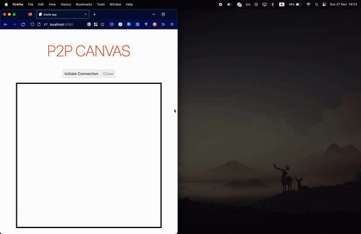

# Real-Time P2P Collaborative Canvas

# How

In order to connect to another peer and start the P2P communication, we need to know where the other peer is located on the Web.
The [`RTCPeerConnection`](https://developer.mozilla.org/en-US/docs/Web/API/RTCPeerConnection) interface is responsible for this.

In order to initiate `RTCPeerConnection` the peers need to undergo a some sort of handshake process. This process is called **Signaling** and **Negotiation**. Traditionally you create a server that handles this process by creating a possible list of peers, choose with whom to connect, handle offers and answers, and finally setup the connection.

However, since WebRTC does not include the standard of the handshake and protocol or technology may be used. So for this POC I decided to use [`BroadcastChannel`s](https://developer.mozilla.org/en-US/docs/Web/API/BroadcastChannel).

**BroadcastChannel** is an interface that allows communication between different browsing contexts. _(on the same origin)_

The `src/services/p2p.ts` file includes all the logic necessary for the steps mentioned above.

# Running The Project

- Clone the repo:
  - `git clone https://github.com/rasjonell/p2p-canvas`
- Navigate to the project and install the dependencies:
  - `cd p2p-canvas`
  - `npm install`
- Run the development server:
  - `npm run dev`